# CardioIA - Mapa Mental do Projeto

## Visualização do Mapa Mental

Este diagrama representa a estrutura completa do projeto CardioIA: A Nova Era da Cardiologia Inteligente, incluindo contexto, objetivos e todas as 7 fases do projeto.

```mermaid
graph LR
    Root["<b>🫀 CardioIA</b><br/>A Nova Era da<br/>Cardiologia Inteligente"]
    
    Root --> Contexto["<b>CONTEXTO</b>"]
    Root --> Objetivos["<b>OBJETIVOS</b>"]
    Root --> Fases["<b>FASES DO PROJETO</b>"]
    
    Contexto --> Doencas["🩺 Doenças<br/>Cardiovasculares"]
    Doencas --> D1["Principal causa de mortes no mundo, com aproximadamente 17,9 milhões de óbitos anuais"]
    Doencas --> D2["Infartos, arritmias, insuficiência cardíaca e AVCs são comuns e podem ser prevenidos com diagnóstico precoce"]
    
    Contexto --> TecIA["🤖 Tecnologia e IA"]
    TecIA --> T1["A IA tem potencial para revolucionar a cardiologia, antecipando eventos críticos e personalizando cuidados"]
    TecIA --> T2["O Projeto CardioIA visa criar uma plataforma digital interativa para simular um ecossistema de cardiologia moderna"]
    
    Objetivos --> Impacto["🎓 Impacto Acadêmico<br/>e Social"]
    Impacto --> I1["Conectar os grupos de estudantes a uma das áreas do mercado que demanda bastante de profissionais de IA"]
    Impacto --> I2["Simular a prática hospitalar com dados reais e desafios autênticos"]
    
    Objetivos --> Solucoes["💻 Desenvolvimento de<br/>Soluções Tecnológicas"]
    Solucoes --> S1["Criar sistemas de triagem digital, diagnósticos assistidos por IA, monitoramento de sinais vitais, e chatbots para orientação de pacientes"]
    
    Fases --> F1["<b>FASE 1</b><br/>Batimentos de Dados - Mapeando o Coração Moderno"]
    F1 --> F1A["Construção de uma base de dados de pacientes cardiológicos com informações relevantes"]
    F1 --> F1B["Coleta de dados de fontes públicas, pacientes simulados ou formulários interativos"]
    F1 --> F1C["Discussão e entendimento sobre governança em IA e impacto dos dados no projeto"]
    
    Fases --> F2["<b>FASE 2</b><br/>Diagnóstico Automatizado - IA no Estetoscópio Digital"]
    F2 --> F2A["Desenvolvimento de modelos de IA para identificar riscos de doenças"]
    F2 --> F2B["Uso de classificadores supervisionados e reflexão sobre responsabilidade no uso da IA na medicina"]
    
    Fases --> F3["<b>FASE 3</b><br/>Monitoramento Contínuo - IoT no Peito do Paciente"]
    F3 --> F3A["Simulação de um wearable médico com sensores ESP32 para monitoramento em tempo real"]
    F3 --> F3B["Montagem de dashboard para apresentação de dados"]
    
    Fases --> F4["<b>FASE 4</b><br/>Visão Computacional - Diagnóstico com Visão Computacional"]
    F4 --> F4A["Desenvolvimento de um sistema para interpretar imagens de exames médicos"]
    F4 --> F4B["Foco em treinar modelos para detectar alterações suspeitas e criar módulos de visualização"]
    
    Fases --> F5["<b>FASE 5</b><br/>Assistente Virtual - Assistente Cardiológico Virtual"]
    F5 --> F5A["Criação de um chatbot para acompanhamento de pacientes em casa"]
    F5 --> F5B["Uso de NLP e discussão sobre ética e empatia no atendimento virtual"]
    
    Fases --> F6["<b>FASE 6</b><br/>Previsão de Crises - Previsão de Crises com IA"]
    F6 --> F6A["Desenvolvimento de um sistema preditivo de eventos cardíacos com base em séries temporais"]
    F6 --> F6B["Treinamento de modelos para prever picos de risco e planejamento de protocolos de emergência"]
    
    Fases --> F7["<b>FASE 7</b><br/>Plataforma Total - Plataforma de Inteligência Cardíaca Total"]
    F7 --> F7A["Integração de todos os módulos em uma única plataforma funcional"]
    F7 --> F7B["Foco em usabilidade, fluxo de informação e apresentação da arquitetura final da solução"]
    
    style Root fill:#1e3a8a,stroke:#1e40af,stroke-width:4px,color:#fff
    style Contexto fill:#f59e0b,stroke:#d97706,stroke-width:3px,color:#000
    style Objetivos fill:#10b981,stroke:#059669,stroke-width:3px,color:#fff
    style Fases fill:#8b5cf6,stroke:#7c3aed,stroke-width:3px,color:#fff
    style F2 fill:#dc2626,stroke:#b91c1c,stroke-width:3px,color:#fff
    style F1 fill:#e0e7ff,stroke:#818cf8,stroke-width:2px
    style F3 fill:#ddd6fe,stroke:#a78bfa,stroke-width:2px
    style F4 fill:#fce7f3,stroke:#f472b6,stroke-width:2px
    style F5 fill:#fef3c7,stroke:#fbbf24,stroke-width:2px
    style F6 fill:#fbcfe8,stroke:#ec4899,stroke-width:2px
    style F7 fill:#d1fae5,stroke:#34d399,stroke-width:2px
```

## Como Visualizar

Este diagrama pode ser visualizado em:
- **GitHub/GitLab**: Renderização automática em arquivos `.md`
- **VSCode**: Com extensões Mermaid instaladas
- **Mermaid Live Editor**: https://mermaid.live
- **Outros editores**: Que suportem renderização de Mermaid

## Estrutura do Projeto

### Contexto
O projeto surge da necessidade de combater as doenças cardiovasculares, principal causa de mortes no mundo, através da tecnologia e inteligência artificial.

### Objetivos
- Conectar estudantes às demandas do mercado de IA
- Simular práticas hospitalares reais
- Desenvolver soluções tecnológicas para cardiologia

### Fases
O projeto é dividido em 7 fases progressivas, cada uma construindo sobre a anterior:
1. Coleta e governança de dados
2. Diagnóstico automatizado (atual)
3. Monitoramento com IoT
4. Visão computacional
5. Assistente virtual
6. Previsão de crises
7. Plataforma integrada completa
