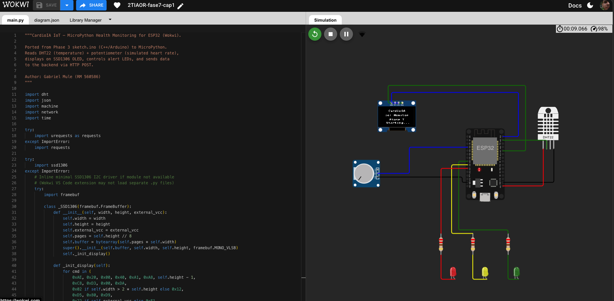
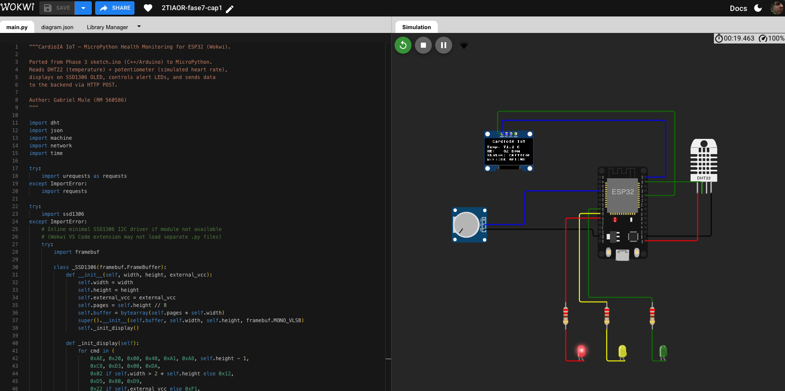
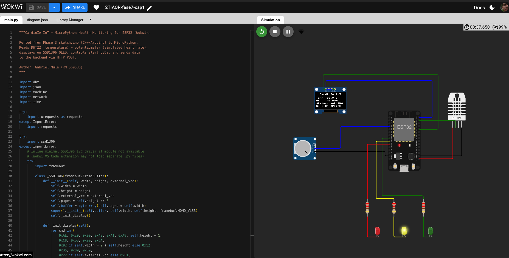
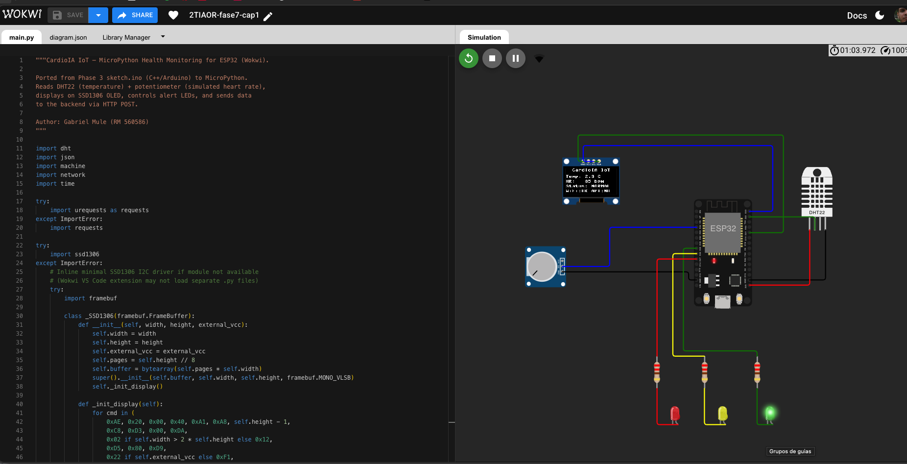

# FIAP - Faculdade de Informática e Administração Paulista

<p align="center">
<a href= "https://www.fiap.com.br/"></a>
</p>

<br>

# CardioIA — Plataforma de Inteligência Cardíaca Total

## 2TIAOR — Fase 7, Capítulo 1

<p align="center">
  <a href="https://twotiaor-fase7-cap1.onrender.com/health"></a>
  <a href="https://2-tiaor-fase7-cap1.vercel.app/"></a>
  <a href="https://expo.dev/accounts/gabemule/projects/cardioai/builds/4f3fd8fa-5e6a-43a5-8606-1ded7d704d28"></a>
  <a href="https://wokwi.com/projects/466225873706038273"></a>
</p>

## 👨‍🎓 Integrantes:
- <a href="https://www.linkedin.com/in/gabmule/">Gabriel Mule</a> — RM 560586

## 🎥 Vídeo Demonstração

> ### **[▶️ ASSISTA AO VÍDEO DE DEMONSTRAÇÃO](https://youtu.be/USCApx9ZqKM)**
>
> Duração: ~7 minutos | Conteúdo: Arquitetura completa, backend, web dashboard, app mobile, simulação IoT

## 🔗 Links da Entrega

| Componente | Link |
|-----------|------|
| 🌐 Web Dashboard | [CardioIA Web](https://2-tiaor-fase7-cap1.vercel.app/) |
| 📱 Mobile APK | [EAS Build — CardioIA APK](https://expo.dev/accounts/gabemule/projects/cardioai/builds/4f3fd8fa-5e6a-43a5-8606-1ded7d704d28) |
| 🔌 IoT Simulation | [Wokwi — ESP32 CardioIA](https://wokwi.com/projects/466225873706038273) |

<p align="center">
  
  
</p>
<p align="center">
  
  
</p>

---

## 📜 Descrição

A **Fase 7** marca o ápice da CardioIA como uma **Plataforma de Inteligência Cardíaca Total**. O foco deixa de ser módulos isolados e passa a ser a **integração transdisciplinar** — convertendo a inteligência preditiva construída nas fases anteriores em um produto digital funcional, centrado no usuário.

**Parte 1 — Frontend & Deploy:** Um **web dashboard** (React + Vite + TypeScript + shadcn/ui) hospedado no Vercel com CI/CD, e um **app mobile** (React Native + Expo + React Native Paper) com APK gerado via EAS Build. Ambos consomem a API REST unificada e oferecem visualização de dados cardíacos, predição de risco e chat com IA.

**Parte 2 — Backend Integrador & IoT:** Um **backend Python** (FastAPI) que centraliza todos os módulos das fases anteriores — modelo de predição RF (Fase 6), base de conhecimento sintoma-doença (Fase 2), chat com LLM (OpenRouter), e ingestão de dados IoT. O **módulo IoT** (MicroPython no ESP32 via Wokwi) é uma conversão direta do `sketch.ino` da Fase 3 (C++/Arduino → MicroPython), com sensores DHT22 + potenciômetro, display OLED SSD1306, LEDs de alerta e envio HTTP para o backend.

A integração entre todas as partes ocorre pela API REST do backend: o IoT envia dados de sensores, o web/mobile consomem endpoints de predição, chat e monitoramento, e o modelo RF (`cardio_risk.joblib` da Fase 6) é invocado diretamente para inferência sem dependência do LLM.


## 📁 Estrutura de pastas

Dentre os arquivos e pastas presentes na raiz do projeto, definem-se:

- **assets**: logo FIAP e recursos visuais do repositório.

- **backend**: serviço FastAPI integrador — API REST com 7 endpoints (auth, predict, chat, sensors, symptoms, health).
  - `src/` — código-fonte (routers, schemas, model, data loaders)
  - `models/` — modelo RF treinado (`cardio_risk.joblib`, reuso da Fase 6)
  - `data/` — protocolos clínicos (`protocols.json`) e base de conhecimento (`knowledge_map.csv`, reuso da Fase 2)
  - `bruno/` — collection de testes de API (18 requests organizados por endpoint)

- **web**: aplicação web React + Vite + TypeScript + shadcn/ui — dashboard de monitoramento cardíaco.

- **mobile**: aplicação mobile React Native + Expo + React Native Paper — app com mesmas funcionalidades do web.

- **iot**: módulo MicroPython para ESP32 (Wokwi) — conversão do `sketch.ino` da Fase 3.
  - `main.py` — lógica de sensores, OLED, LEDs e HTTP POST
  - `diagram.json` — circuito Wokwi (ESP32 + DHT22 + potenciômetro + 3 LEDs + OLED SSD1306)
  - `ssd1306.py` — driver do display OLED

- **docs**: documentação técnica — [diagrama de arquitetura](docs/architecture.md) (Mermaid), [relatório técnico](docs/report.md) e [relatório em PDF](docs/report.pdf).

- **README.md**: arquivo que serve como guia e explicação geral sobre o projeto (o mesmo que você está lendo agora).


## 🔧 Como executar o código

### Pré-requisitos

- Python 3.11+
- Node.js 18+
- Conta no [OpenRouter](https://openrouter.ai/) com créditos

### Backend

```bash
cd backend

# Ativar venv e instalar dependências
chmod +x setup.sh && source setup.sh

# Configurar variáveis de ambiente
cp .env.example .env
# Editar .env com sua OPENROUTER_API_KEY

# Rodar servidor de desenvolvimento
make dev
```

A API estará disponível em `http://localhost:8000`. Veja `backend/bruno/` para a collection completa de testes.

### Web

```bash
cd web
npm install
npm run dev
```

### Mobile

```bash
cd mobile
npm install

# Configurar variáveis de ambiente
cp .env.example .env

# Rodar em modo desenvolvimento
npx expo start

# Gerar APK (requer login: npx eas login)
npx eas build -p android --profile preview
```

### IoT (Wokwi)

Abra a [simulação no Wokwi](https://wokwi.com/projects/466225873706038273) ou use a extensão Wokwi no VS Code com o diretório `iot/`.

### Variáveis de ambiente

**Backend** (`backend/.env`):

| Variável | Descrição | Default |
|---|---|---|
| `OPENROUTER_API_KEY` | Chave da API (OpenRouter) | — (obrigatória) |
| `LLM_MODEL` | Modelo LLM | `openai/gpt-4o-mini` |
| `HOST` | Host do servidor | `0.0.0.0` |
| `PORT` | Porta do servidor | `8000` |

**Web** (`web/.env`):

| Variável | Descrição | Default |
|---|---|---|
| `VITE_API_URL` | URL base da API | `http://localhost:8000` |

**Mobile** (`mobile/.env`):

| Variável | Descrição | Default |
|---|---|---|
| `EXPO_PUBLIC_API_URL` | URL base da API | `https://twotiaor-fase7-cap1.onrender.com` |


## 📡 API Endpoints

| Método | Endpoint | Descrição |
|--------|----------|-----------|
| GET | `/health` | Health check |
| POST | `/api/auth/login` | Autenticação (mock: admin/cardioai) |
| POST | `/api/predict` | Predição de risco cardíaco (modelo RF) |
| POST | `/api/chat` | Chat com assistente IA (LLM) |
| POST | `/api/sensors` | Ingestão de dados IoT |
| GET | `/api/sensors/latest` | Últimas leituras de sensores |
| GET | `/api/symptoms/knowledge` | Base de conhecimento sintoma-doença |
| GET | `/api/symptoms/search?q=` | Busca de sintomas |


## 📂 Integração Cross-Phase

| Fase | Artefato | Reuso na Fase 7 |
|------|----------|-----------------|
| Fase 2 | `knowledge_map.csv` (34 associações sintoma-doença) | Backend — enriquecimento do chat e busca de sintomas |
| Fase 3 | `sketch.ino` (ESP32 C++, 1475 linhas) | IoT — conversão direta para MicroPython (~290 linhas) |
| Fase 6 | `cardio_risk.joblib` (Random Forest) | Backend — endpoint de predição de risco |
| Fase 6 | `protocols.json` (protocolos clínicos) | Backend — recomendações baseadas no nível de risco |


## 🗃 Histórico de lançamentos

* 1.0.0 - 08/07/2026
    * Deploy backend no Render com integração IoT (Wokwi → Render)
    * Web dashboard com login, predição de risco, monitoramento IoT e chat IA
    * App mobile (Expo SDK 56 + React Native Paper) com APK via EAS Build
    * Diagrama de arquitetura e relatório técnico em `docs/`
* 0.1.0 - 07/07/2026
    * Backend integrador completo (FastAPI, 7 endpoints, Bruno collection)
    * Módulo IoT MicroPython (conversão do sketch.ino da Fase 3)

## 📋 Licença

<p xmlns:cc="http://creativecommons.org/ns#" xmlns:dct="http://purl.org/dc/terms/"><a property="dct:title" rel="cc:attributionURL" href="https://github.com/agodoi/template">MODELO GIT FIAP</a> por <a rel="cc:attributionURL dct:creator" property="cc:attributionName" href="https://fiap.com.br">Fiap</a> está licenciado sobre <a href="http://creativecommons.org/licenses/by/4.0/?ref=chooser-v1" target="_blank" rel="license noopener noreferrer" style="display:inline-block;">Attribution 4.0 International</a>.</p>
