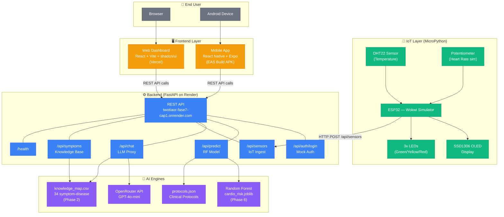

# CardioIA — Architecture Diagram

> Phase 7: Full Cardiac Intelligence Platform

## System Architecture (Mermaid)



## Data Flow Description

```
┌─────────────┐     HTTP POST        ┌──────────────────┐
│  ESP32/IoT  │ ──────────────────→  │  FastAPI Backend  │
│  (Wokwi)    │  /api/sensors        │  (Render)         │
└─────────────┘                      │                   │
                                     │  ┌─────────────┐  │
┌─────────────┐     REST API         │  │ RF Model    │  │
│  Web App    │ ──────────────────→  │  │ (Phase 6)   │  │
│  (Vercel)   │  /api/predict        │  └─────────────┘  │
│             │  /api/chat           │                   │
│             │  /api/sensors/latest  │  ┌─────────────┐  │
└─────────────┘                      │  │ OpenRouter   │  │
                                     │  │ (LLM Proxy)  │  │
┌─────────────┐     REST API         │  └─────────────┘  │
│  Mobile App │ ──────────────────→  │                   │
│  (Expo APK) │  Same endpoints     │  ┌─────────────┐  │
└─────────────┘                      │  │ Knowledge   │  │
                                     │  │ Map (Ph. 2) │  │
                                     │  └─────────────┘  │
                                     └──────────────────┘
```

## Key Architecture Decisions

| Decision | Rationale |
|----------|-----------|
| **API key backend-only** | OpenRouter key stored exclusively on Render env vars. Frontend never holds secrets. |
| **Single REST API** | Both web and mobile consume the same `/api/*` endpoints — no duplication. |
| **Mock auth** | Simplified for MVP: `admin`/`cardioai` returns a JWT-like token. |
| **In-memory sensor store** | Lightweight for demo; last 100 readings kept in a deque. |
| **Wokwi for IoT** | No physical hardware needed; ESP32 + MicroPython simulated in browser. |
| **OpenRouter as LLM proxy** | Model-agnostic: switch between GPT-4o-mini, Claude, etc. via env var. |

## Cross-Phase Integration Map

| Phase | Artifact | Reuse in Phase 7 |
|-------|----------|-------------------|
| Phase 2 | `knowledge_map.csv` (34 symptom-disease associations) | Backend — chat enrichment & symptom search |
| Phase 3 | `sketch.ino` (ESP32 C++, 1475 lines) | IoT — direct conversion to MicroPython (~290 lines) |
| Phase 6 | `cardio_risk.joblib` (Random Forest model) | Backend — `/api/predict` risk prediction |
| Phase 6 | `protocols.json` (clinical protocols) | Backend — risk-based recommendations |
